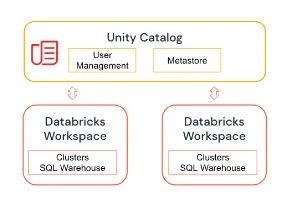
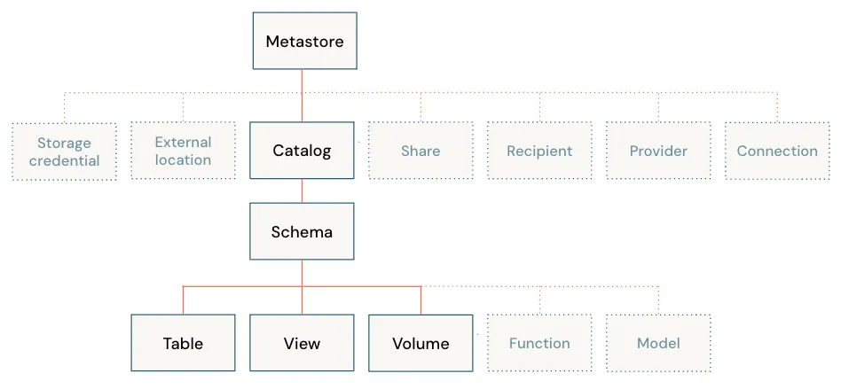

## 背景
数据湖里的数据和表越来越多，包括训练里的模型也越来越多，如何将模型和表管理起来，变得更加麻烦，需要一个统一的平台进行管理。目前业界商用SaaS平台里 Databricks 的 Unity Catalog 做得比较好，开源的 DataHub 也是做统一Catalog 的

## 什么是 Unity Catalog?
Unity Catalog 是一个统一的大数据 + AI 资产治理解决方案，提供跨 workspace 的权限管控、审计、数据血缘及数据发现功能。

大致结构如下图:

## 功能
- **Define once, secure everywhere**：统一的 ACL 管控，只需要在一处定义 ACL Policy 就可以在所有的 workspace 中使用了
- **Standards-compliant security model**：标准的 ANSI SQL 安全模型，管理员可以使用标准的 SQL 语法为 Catalog、Schema、Table 和 View 执行权限操作
- **Built-in auditing and lineage**：自动采集user级别的审计日志，自动采集数据血缘
- **Data discovery**：允许用户给数据集打标签和添加描述信息，提供搜索界面帮助数据消费者查找数据
- **System tables (Public Preview)**：允许用户访问和查询账户的操作数据，包括审计日志、账单数据及血缘数据

## Unity Catalog 对象模型
Unity Catalog 对象模型自顶向下分别是: **Metastore ——> Catalog ——> Schema ——> Table、View、Volume、Function、Model**

如下图：

其中 Volume 主要是用于管理非结构化数据、Model 用于管理ML模型, 需要在 [MLflow Model Registry](https://www.mlflow.org/docs/latest/model-registry.html) 中注册才能采集到。

### Metastore
Unity Catalog 的顶层Container， 用于存储关于数据资产 (表、视图、卷、模型等) 的元数据，以及管理对这些数据资产访问权限的权限信息。

### Catalog
Unity Catalog 三层 namespace 结构中的第一层，用于组织用户数据资产，用户可以查看所有被授予 ``UER CATALOG`` 权限的 catalog。

### Schemas
Schema 是 Unity Catalog 三层 namespace 中的第二层，用于组织表和视图。用户可以查看在 schema 的父catalog 中拥有 ``USE CATALOG`` 权限，在schema中用于 ``USE SCHEMA`` 权限的所有schema 列表。如果用户拥有表和视图的`SELECT`权限，就可以访问或者 list 该 schema 下的表和视图。

### Volumes
volumes 处于 Unity Catalog 三层 namespace 中的第三层，与表、视图及其他由 schema 组织的 object 属于同级关系。volumes 包含以任意格式存储的数据目录和文件，volume 提供对数据的非表格访问，volume 中的数据文件不能被注册成为表格。
要创建 volume ，用户必须具有 ``CREATE VOLUME`` 和 ``USE SCHEMA`` 权限，且必须具有对应 catalog 的 ``USE CATALOG`` 权限。
要读取 volume 中的文件和目录，用户必须具有 ``READ VOLUME`` 权限，且具有对应 schema 和 catalog 的 ``USE SCHEMA`` 和 ``USE CATALOG`` 权限。
要添加 、删除、修改 volume 的文件或者目录，用户必须具有 ``WRITE VOLUME`` 权限，且必须具有对应schema 和 catalog 的 ``USE SCHEMA`` 和 ``USE CATALOG`` 权限。

### Tables
table 处于 Unity Catalog 三层 namespace 中的第三层，用于管理表格数据。要创建表，用户必须具有 CREATE 权限及对应 schema 和 catalog 的 ``USE SCHEMA`` 和 ``USE CATALOG`` 权限。要查询表，用户必须具有 ``SELECT`` 权限及对应 schema 和 catalog 的 ``USE SCHEMA`` 和 ``USE CATALOG`` 权限。要修改或者删除表，用户必须具有相应的 ``ALTER``、``DROP`` 权限。table 跟普通数据湖一样，分 `managed table` 和 `external table`。

### Views
view 是基于 metastore 中的表或者其他 view 创建的只读对象，处于 Unity Catalog 中的第三层。用户可以基于不同的 schema 和 catalog 中的表或者视图来创建 view，用户也可以通过创建 dynamic view 来实现行级或者列级权限管控。

### Models
model 处于 Unity Catalog 三层 namespace 中的第三层，unity catalog 中的 model 是指在 [MLflow Model Registry](https://www.mlflow.org/docs/latest/model-registry.html) 中注册的机器学习模型，要在 Unity Catalog 中创建model，用户需要在对应的 schema 和 catalog 中拥有 `CREATE MODEL` 权限，同时还需要拥有对应 schema 和 catalog 的 ``USE SCHEMA`` 和 ``USE CATALOG`` 权限。

## Unity Catalog 与我们现有方案的关联
Unity Catalog 的 metastore 类似于 HMS，存储元数据，权限管控类似 Ranger，血缘及数据发现类似 Datahub，模型治理功能是集成了MLflow的模型注册功能，可以说 Unity Catalog 是 HMS、Ranger、Datahub、MLflow 的集合。

