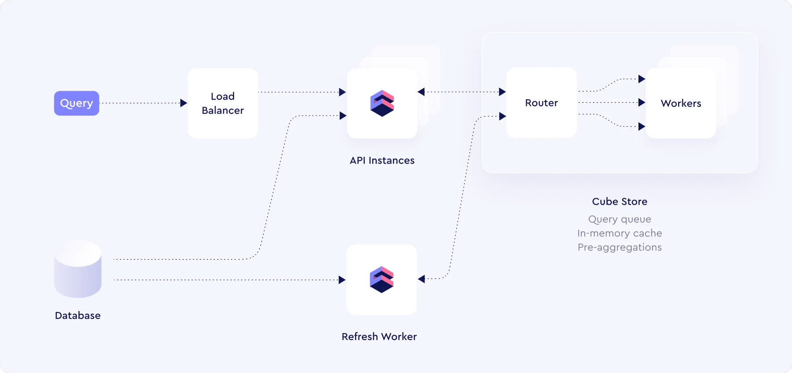
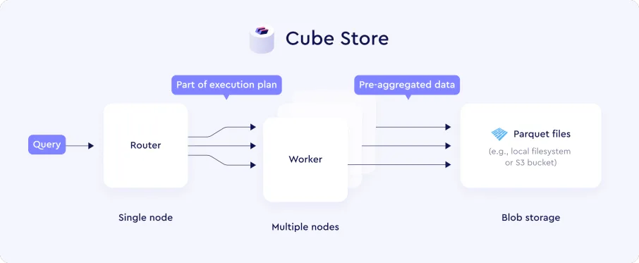
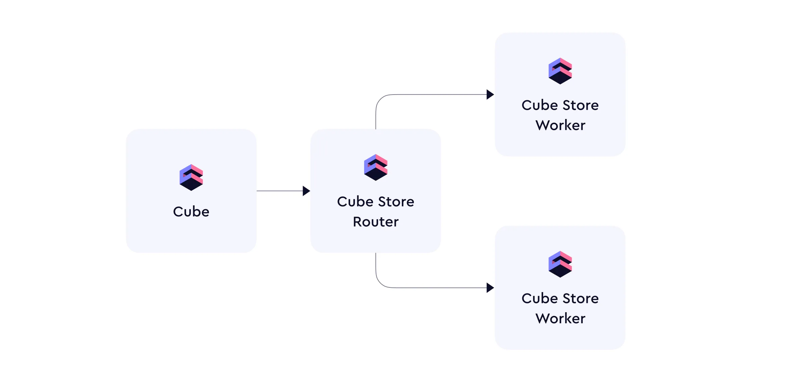
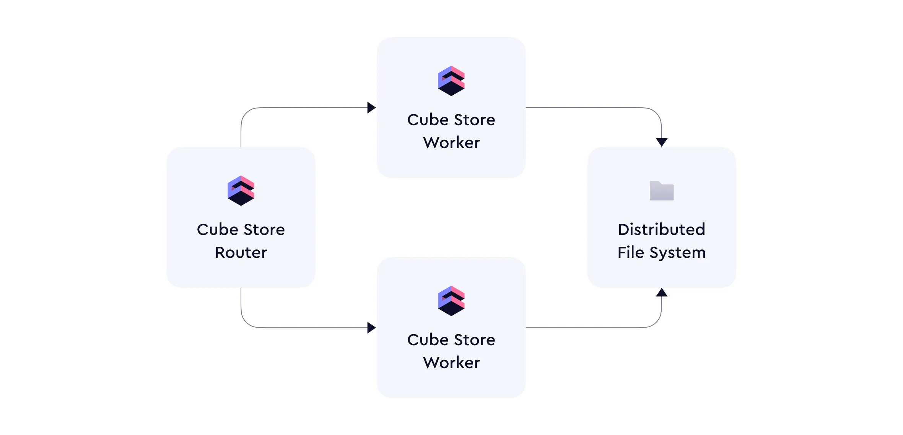

生产级别的 Cube 一般由以下几个组件组成:

- 一个或者多个 API instance
- 一个 Refresh Worker
- 一个 Cube Store 集群

**每个组件的功能**:

- **API Instances**: 处理 API 请求，然后将数据从 Cube Store 的预汇总或者从原始 DB中查询出来
- **Refresh Worker**: 在后台构建或者更新预汇总数据
- **Cube Store**: 存储 Refresh Worker 预汇总的数据，并处理 API Instance 查询请求的数据

**Cube Store 架构** Cube Store 是专为存储 Cube 预聚合而设计的，Cube Store 使用的是分布式查询引擎架构，每个 Cube Store 集群都是由以下部分组成:

- 一个或者多个 router 节点，处理 connection 连接、管理元数据、构建查询优化及协调他们的执行
- 多个 worker 节点，用于分布式预热数据、执行查询
- 本地或基于云的Blob存储以列存储的格式来保存预聚合的数据

 默认情况下, Cube Store 监听 3030 端口来获取 Cube 的查询请求。这个端口可以通过修改环境变量 CUBESTORE_HTTP_PORT 来修改这个端口，为了使用自定义端口，请确保在 Cube API Instance 和 Refresh Worker 中同时修改 CUBEJS_CUBESTORE_PORT 变量。 router 和 worker 使用相同的 image，要管理这两个角色，需要修改如下变量:

| **环境变量** | **Router** | **Worker** |
| --- | --- | --- |
| CUBESTORE_SERVER_NAME | Yes | Yes |
| CUBESTORE_META_PORT | Yes | - |
| CUBESTORE_WORKERS | Yes | Yes |
| CUBESTORE_WORKER_PORT | - | Yes |
| CUBESTORE_META_ADDR | - | Yes |

**Cube Store Router**  负责接收来自 Cube 的查询、管理CubeStore 集群的元数据及优化和分发 Workers 的请求，同时提供兼容 MySQL 协议的接口来直接查询 CubeStore 中预汇总的结果。Cube 只会与 Router 通信，不会直接与 Worker 通信。

**Cube Store Worker**  Cube Store 集群中的 Worker 负责接收和执行来自 Router 中的查询，并直接与底层分布式文件系统交互，执行插入、查询和预汇总预热。Worker 之间不会直接交互，而是通过 Router 来分发查询和管理相关的元数据。

**Scaling 能力** 虽然 Cube Store 可以以单实例模式运行，但是这种模式不适用于生产环境。对于高并发、高吞吐而言，建议将 Cube Store 运行在多实例的集群上。得益于存储与查询引擎已经分离(存算分离)，用户可以根据并发及吞吐量需求水平扩展 Cube Store 集群。

**存储** Cube Store 使用单独的存储层来分别存储元数据和预聚合的 parquet 数据文件，Cube Store 可以使用 AWS S3 和 GCS，如果集群的所有节点都在一个机器上的话，也可以使用本地路径（**风险点: **目前我们使用的是 oss，CubeStore 是用 rust 写的，截止到 2024-01-26，阿里云尚未提供 oss 的 rust sdk，CubeStore 目前也还没支持 oss，需要同时自己实现 oss rust sdk 和 CubeStore 的 oss 存储模块） 新版本的 CubeStore 支持 MinIO，但是MinIO 的开源协议是 GUN AGPL3，商业公司使用有风险，我们尽量不要使用，避免带来不必要的麻烦。

