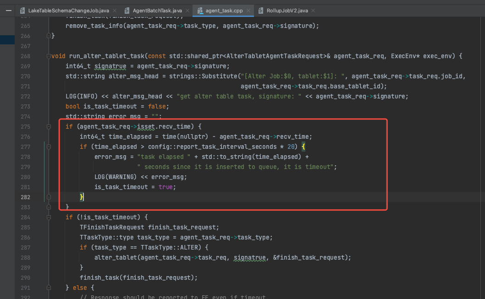

# StarRocks 3.2 存算分离大表 schema 变更超时

2025年上班第一天，客户新增了字段，需要在 StarRocks 端也新增相应的字段，以适配业务方2025年的运营策略需求，执行 schema 变更的表大小是 500G 左右，
 StarRocks 是 3.2 存算分离版本，由于 StarRocks 执行 job 操作都是异步处理的，执行``` alter table xxx add column x x default 'v' ```，客户端里面返回成功，
以为 SQL 已经运行成功了，然后就直接上先代码。

大概5分钟后，k8s pod 疯狂告警，报找不到 column，赶忙确认 schema, 确实没有更新成功，查看 alter 任务状态```show alter table COLUMN;``` 发现任务还在运行当中，进度只有 50%，以为等一会就好了，没有回滚代码。

再过5分钟后，k8s pod 还在疯狂的报找不到 column，查看alter 任务状态，任务已经 cancel了，error message: ```schema change task failed after try three times: task type: ALTER, status_code: CANCELLED, task elapsed 223 seconds since it is inserted to queue, it is timeout, backendId: 10005, signature: 147405```

再尝试提交 alter 任务，发现10分钟后，还是报 timeout，发现不对劲，赶忙回滚代码

由于公司降本增效，人力被降掉了，我们将 StarRocks 换成了某公有云全托管的 StarRocks，全托管嘛！就是托着不管！那些外包客服各种已读乱回，看不下去了，赶紧github 下代码，。

查看代码发现，报错消息从这块代码中来:



这个参数是 Job 级别的，配置之后不需要重启，就可以生效，里面配置一下，重新执行 alter 命令，发现已经不报错了，但是发现还是非常的慢，最后花了2个小时终于执行成功。

此外：3.3 版本已经支持 fast  schema evolution，如果有人力，可以升级到 3.3，我们人力已经被降掉了，估计接下来的一段时间内都没有人力去做这些事情了

## 教训：
- 在代码上线前，先把各种可能出错的步骤先检查一遍
- schema 变更，得先看一下schema 是否已经变更好了再上代码
